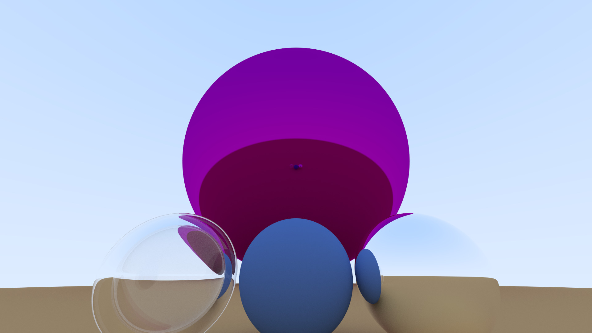

Thank you for checking out the code for the multithreaded ray tracing engine—I really appreciate it!

Most of the code I wrote is concentrated in the Camera class and the ThreadPool class. As the name suggests, a ray tracing engine involves working with rays, and in our case, we utilize vectors. This mathematical concept has been a bit more challenging for me, but I believe that more practice never hurts.

I discovered a valuable resource on Repo X (also known by other names such as Build Your Own X/Project X), which provides various coding projects and ideas. Specifically, I found the "Ray Tracing in One Weekend" series by Peter Shirley, Trevor David Black, and Steve Hollasch to be incredibly helpful.

In the following sections, I walk through the original one-week book by these authors and explain how I self-taught myself to implement and effectively use multithreading in C++. By applying skills learned in my Data Structures and Algorithms class, I was able to assess the efficiency of the enhancements I made to the original ray tracing engine, enabling it to render images much faster.

Simply compile the main file; all other code is linked together through the headers.

